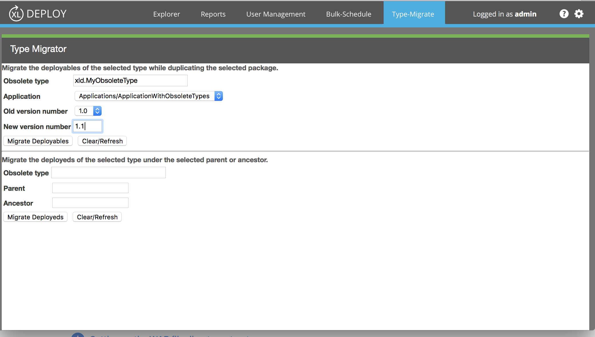

# XL Deploy Type Migrator plugin

[![Build Status][xld-type-migrator-plugin-travis-image]][xld-type-migrator-plugin-travis-url]
[![License: MIT][xld-type-migrator-plugin-license-image]][xld-type-migrator-plugin-license-url]
![Github All Releases][xld-type-migrator-plugin-downloads-image]

[xld-type-migrator-plugin-travis-image]: https://travis-ci.org/xebialabs-community/xld-type-migrator-plugin.svg?branch=master
[xld-type-migrator-plugin-travis-url]: https://travis-ci.org/xebialabs-community/xld-type-migrator-plugin
[xld-type-migrator-plugin-license-image]: https://img.shields.io/badge/License-MIT-yellow.svg
[xld-type-migrator-plugin-license-url]: https://opensource.org/licenses/MIT
[xld-type-migrator-plugin-downloads-image]: https://img.shields.io/github/downloads/xebialabs-community/xld-type-migrator-plugin/total.svg

## Preface

This document describes the functionality provided by the XL Deploy Type Migrator plugin.

See the [XL Deploy reference manual](https://docs.xebialabs.com/xl-deploy) for background information on XL Deploy and deployment automation concepts.  

## Overview

This plugin provides a UI screen that allows migration of an obsolete type to the new type that supersedes it.  

## Requirements

* XL Deploy 5.5

## Installation

* Copy the latest JAR file from the [releases page](https://github.com/xebialabs-community/xld-type-migrator-plugin/releases) into the `XL_DEPLOY_SERVER/plugins` directory.
* Restart the XL Deploy server.

## Features/Usage/Types/Tasks

* For Deployables, the input is the obsolete type and deployment package information; the plugin will generate a new deployment package containing the new type in place of the old one.  

* For Deployeds, the input is an obsolote type and a parent or ancestor under the Infrastructure node.  A new type will be created in the same location as the obsolete type.

* A migration helper plugin containing a mapProperties.py method must be installed.  The migration helper:
 * Can be defined in code under the `XL_DEPLOY_SERVER/ext` directory, or a in plugin jar or xldp file.
 *  Contains a synthetic.xml file with a definition of the obsolete type and its properties.
 *  Contains a directory named for the obsolete plugin's namespace and a Jython script named for the obsolete type to be migrated, i.e., `typeMigrator/oldNamespace/OldType.py`.
 *  Defines a mapProperties method that maps values from the old type to the new one.

```from com.xebialabs.deployit.plugin.api.reflect import Type

def mapProperties(old, new):
  new.setType(Type.valueOf("xld.TheNewType"))
  if old.SomeOldProperty is not None:    
    new.setProperty('TheCorrespondingNewProperty', old.SomeOldProperty)
  ...
```

* See the [WAS type migrator](https://github.com/xebialabs-community/xld-type-migrator-was-plugin) for an example.


